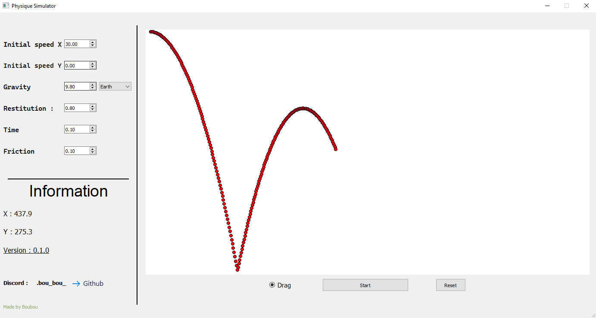

# PhysicsSim2D 🌆

It is a Physics 2D engine made with Python. 🐍

Don't forget to install the __requirements.txt__ 📃

I used __Pyqt5__

## Features 🚩

- Change the restitution
- Set a initial speed X / Y
- Set a time
- Set a friction
- Enabled / disabled drag 

## Screenshot 📷

My application look like : 

## ❗ Information ❓

I know, it contains many error and it isn't perfect.

If you have seen a problem, please contact me.

Discord : .bou_bou_

❗ I am beginner 👶, if you have any idea to improve my project or enhance my knowledge you can contact me !

Thanks, Boubou.
